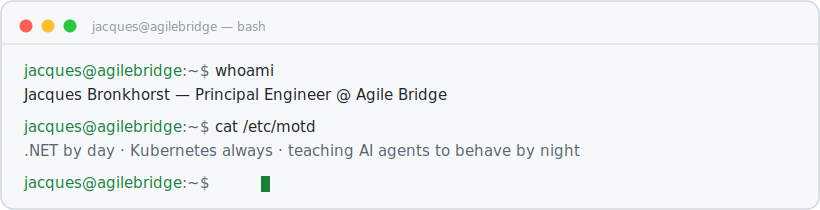

<!-- GENERATED FILE — do not edit. Edit templates/README.md.tmpl and run scripts/render.py -->

<picture>
  <source media="(prefers-color-scheme: dark)" srcset="assets/header-dark.svg">
  
</picture>

### `$ ls ~/projects`

<table>
  <tr>
    <td width="50%" valign="top">
      <b>📦 <a href="https://github.com/JacquesBronk/SARS.TaxCalculator">SARS.TaxCalculator</a></b><br>
      South African PAYE/UIF/SDL/ETI tax engine as a NuGet package. Tax years 2023–2027.<br>
      <sub>↻ 1,124 downloads · v2027.1.1</sub>
    </td>
    <td width="50%" valign="top">
      <b>📦 <a href="https://github.com/JacquesBronk/another-json-lib">another-json-lib</a></b><br>
      JSON serialization, diffing &amp; merging utilities for C#. Because there's always room for another one.
    </td>
  </tr>
  <tr>
    <td width="50%" valign="top">
      <b>🖥️ <a href="https://github.com/JacquesBronk/turing-smart-screen-python">turing-smart-screen-python</a></b><br>
      Fork with a YAML-driven page-carousel platform for Turing/TURZX smart screens — animated netmap, Prometheus-fed host pages, diff-push rendering.
    </td>
    <td width="50%" valign="top">
      <b>🔒 the-bureau</b> <sub>— escaping the lab soon</sub><br>
      Self-correcting multi-agent orchestration via Redis streams &amp; MCP. DAG task graphs, review-rework loops. Currently in containment.
    </td>
  </tr>
</table>

### `$ kubectl get homelab`

```text
COMPONENT               STATUS    DETAIL
k3s-cluster             Ready     23 namespaces, 2 nodes
hailo8-vlm-detections   Ready     792 detections yesterday
homelab-updates         Ready     111 commits yesterday
home-automation         Ready     1,330 triggers yesterday
claude-tokens           Burning   2.81B year-to-date 🔥
```

<sub>↻ this section is pushed by a CronJob running in the cluster itself · last sync: 2026-06-20 02:07 SAST · if this is stale, the lab is probably on fire</sub>

### `$ which --all skills`


### `$ ./invaders --source=contributions`

<picture>
  <source media="(prefers-color-scheme: dark)" srcset="https://raw.githubusercontent.com/JacquesBronk/JacquesBronk/output/commit-invaders-dark.svg">
  <source media="(prefers-color-scheme: light)" srcset="https://raw.githubusercontent.com/JacquesBronk/JacquesBronk/output/commit-invaders.svg">
  
</picture>

<sub>↻ a different arcade game takes the marquee most nights — snake, invaders, pacman, or breakout. The machine decides.</sub>

### `$ history | tail -1`

```text
sudo make me-a-super-saiyan   # still returns exit code 1. someday.
```

<sub>🔗 <a href="https://www2.agilebridge.co.za/">Agile Bridge</a> · <a href="https://www.nuget.org/profiles/JacquesBronk">NuGet</a></sub>
<!-- blog slot reserved: add latest-posts section here when the blog exists -->
